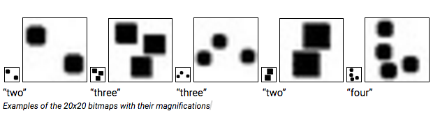
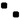
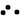

## ELLEN TUCKER
#### EECS 349 Project - Spring 2017
### "Seeing Number"

#### Abstract

Format: 

My task was to create a classifier that would classify an image as the number of objects that it featured, ranging from 2, 3, or 4 objects.  My project is motivated by psychological research that investigates the development of number concepts in children.  Researchers have gained evidence that infants are able to distinguish between groups of 2, 3 and 4 objects, based on experiments in which infants are shown images similar to those within my generated dataset.  Interestingly, groups containing any more than 4 objects are indistinguishable from each other to infants.  I generated a dataset of images of groups of shapes in various spatial configurations and sizes modeled off of psychological stimulus images, and I experimented with nearest neighbor and multilayer perceptron techniques to classify these images based on the number of shapes each contained.

&nbsp;&nbsp;

two &nbsp;&nbsp;&nbsp;&nbsp;&nbsp;&nbsp;&nbsp;&nbsp;&nbsp;&nbsp;&nbsp;&nbsp;&nbsp;&nbsp;&nbsp;&nbsp;&nbsp; &nbsp; &nbsp; &nbsp;&nbsp;&nbsp;&nbsp;&nbsp;&nbsp;&nbsp;&nbsp; three &nbsp;&nbsp;&nbsp;&nbsp;&nbsp;&nbsp;&nbsp;&nbsp;&nbsp;&nbsp;&nbsp;&nbsp;&nbsp;&nbsp;&nbsp;&nbsp;&nbsp;  &nbsp;&nbsp;&nbsp;&nbsp;&nbsp;&nbsp;&nbsp;&nbsp; three &nbsp;&nbsp;&nbsp;&nbsp;&nbsp;&nbsp;&nbsp;&nbsp;&nbsp;&nbsp;&nbsp;&nbsp;&nbsp;&nbsp;&nbsp;&nbsp;&nbsp;  &nbsp;&nbsp;&nbsp;&nbsp;&nbsp;&nbsp;&nbsp;&nbsp;  two &nbsp;&nbsp;&nbsp;&nbsp;&nbsp;&nbsp;&nbsp;&nbsp;&nbsp;&nbsp;&nbsp;&nbsp;&nbsp;&nbsp;&nbsp;&nbsp;&nbsp; &nbsp; &nbsp; &nbsp;&nbsp;&nbsp;&nbsp;&nbsp;&nbsp;&nbsp;&nbsp; four

I was interested in comparing the performance between neural networks and instance-based classifiers on this task.  I used WEKA’s implementations of IBk and Multilayer Perceptron networks.  Both techniques ended up doing remarkably well, each attaining cross-validation and holdout testing accuracies of over 93%.
 
 
 

Read my[report](https://etucker-colorado.github.io/Number-Learning/).

